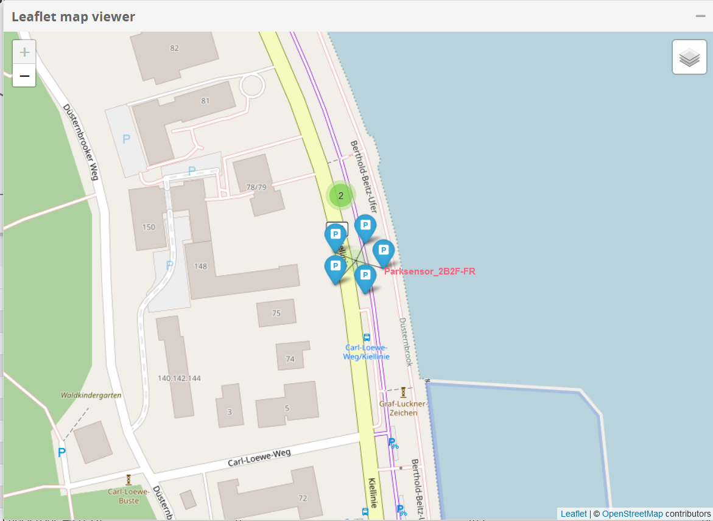
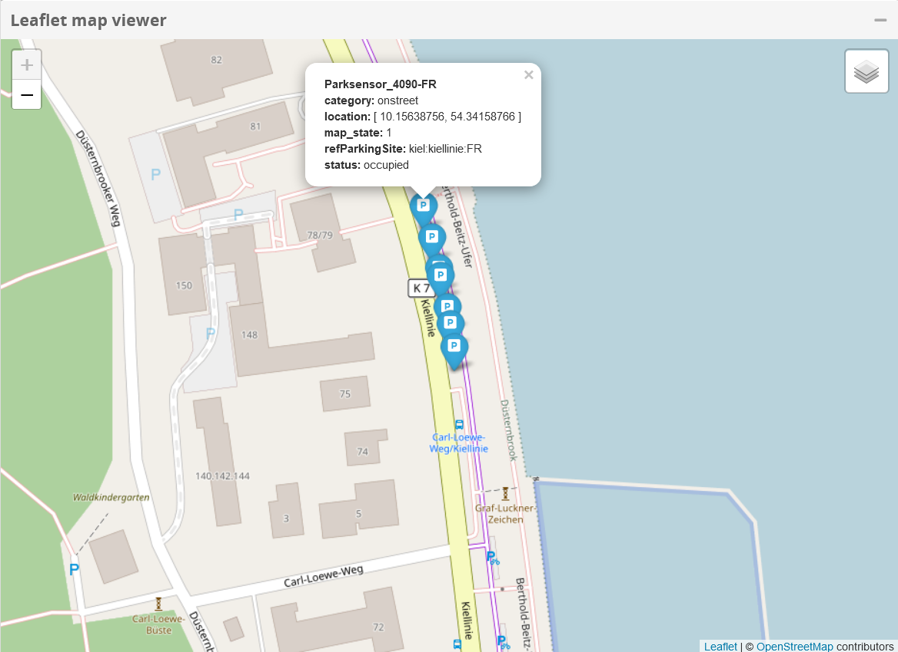

<h2 align="center">
  <a href="https://smart-maas.eu/en/"></a>
  <br>
      SMART MOBILITY SERVICE PLATFORM
  <br>
  <a href="https://smart-maas.eu/en/"></a>
  <br>
</h2>

<p align="center">
  <a href="mailto:info@smart-maas.eu">Contact</a> •
  <a href="https://smart-maas.eu/en/">Project Page</a>
</p>


***

<h1 align="center">
  <a>
    Leaflet map viewer widget
  </a>
</h1>

***


[](https://www.fiware.org/developers/catalogue/)


The Leaflet map viewer widget is a [WireCloud widget](http://wirecloud.readthedocs.org/en/latest/).

[Leaflet](https://leafletjs.com/) is the leading open-source JavaScript library for mobile-friendly interactive 
maps and is also integrated into Wirecloud by means of this widget.

With this widget you have different possibilities to visualize and display your NGSIv2 data on a map depending on the 
entity type.

<p align="center">
    
</p>

The widget includes the following leaflet plugins, which you can use depending on your wishes and the NGSIv2 entities 
available:

* [Leaflet.MovingMarker](https://github.com/zjffun/Leaflet.MovingMarker)
* [Leaflet.Polyline.SnakeAnim](https://github.com/PitouGames/Leaflet.Polyline.SnakeAnim)
* [Leaflet.awesome-markers](https://github.com/lvoogdt/Leaflet.awesome-markers)
* [Leaflet.markercluster](https://github.com/Leaflet/Leaflet.markercluster)

## Examples of visualization options

To know what colors and icons are available to you, take a closer look at the plugin [Leaflet.awesome-markers](https://github.com/lvoogdt/Leaflet.awesome-markers).

- Example with small tooltip and clustering  
  <p align="center">
    
  </p>
  
  <p align="center">
    
  </p>  
  
- Example with default tooltip
  <p align="center">
    
  </p>
  
  <p align="center">
    
  </p>

- Motion Animation
  <p align="center">
    
  </p>
        
- Moving Marker Animation
  <p align="center">
    
  </p>
 
- Snake Animation
  <p align="center">
    
  </p>

and much more...

Build
-----

Be sure to have installed [Node.js](http://node.js) and [Bower](http://bower.io) in your system. For example, you can install it on Ubuntu and Debian running the following commands:

```bash
curl -sL https://deb.nodesource.com/setup | sudo bash -
sudo apt-get install nodejs
sudo apt-get install npm
sudo npm install -g bower
```

Install other npm dependencies by running:

```bash
npm install
```

In order to build this operator you need to download grunt:

```bash
sudo npm install -g grunt-cli
```

And now, you can use grunt:

```bash
grunt
```

If everything goes well, you will find a wgt file in the `dist` folder.

## Documentation

Documentation about how to use this widget is available on the
[User Guide](src/doc/userguide.md). Anyway, you can find general information
about how to use widgets on the
[WireCloud's User Guide](https://wirecloud.readthedocs.io/en/stable/user_guide/)
available on Read the Docs.

## Copyright and License

Copyright (c) 2018 CoNWeT
Licensed under the MIT license.
